<div align="center">

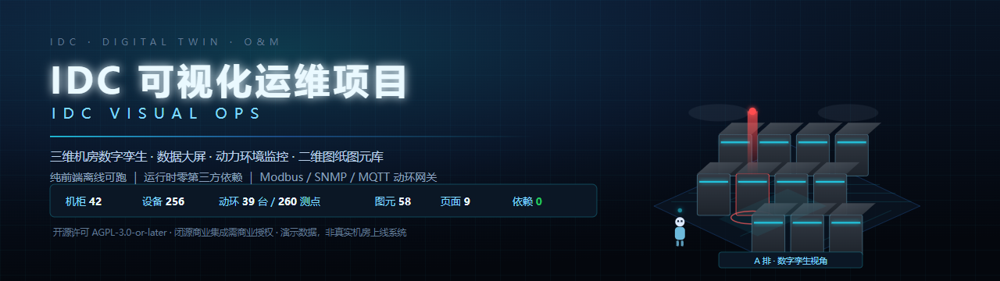

### 三维机房数字孪生 · 数据大屏 · 动力环境监控 · 二维图纸图元库

一个**纯前端、离线可跑**的 IDC 可视化运维平台：42 台机柜的 PBR 拟真数字孪生、9 页运维大屏、
面向机房的**动环（动力环境）系统对接**、58 个图元构成的二维图纸编辑器，以及会说会走的语音巡检助手「小维」。

<sub>运行时零第三方依赖 · 无需构建与后端 · 全部本地示例数据，不上传任何内容</sub>


[](https://github.com/99kevindk/idc-visual-ops/stargazers)
<br/>
[](https://github.com/99kevindk/idc-visual-ops/stargazers)
[](COMMERCIAL-LICENSE.md)

[快速开始](#一快速开始) · [功能对照](#二功能对照与原视频一致) · [目录结构](#三目录结构) · [动环对接](#三点六动环动力环境系统对接) · [开发说明](#四开发说明) · [合规与许可](#八许可证与合规)
<br/>
[项目结构图谱](docs/项目图谱.md) · [动环接口规范](docs/动环接口规范.md) · [图元与图纸规范](docs/机房图纸与图元规范.md) · [商业授权](COMMERCIAL-LICENSE.md)

<sub>中文名：IDC 可视化运维项目 ｜ 英文名：IDC Visual Ops（IDC Visual Operations & Maintenance Platform）</sub>
<sub>界面内产品名：IDC 智能运维管理平台 —— 项目是这套开源工程，产品是界面里的大屏平台</sub>

</div>


<sub><i>三维机房数字孪生：6 排 × 7 台机柜、镂空网孔门、架空地板、顶部桥架与吊顶灯盘、红色告警光柱 —— 全部由代码程序化建模（含贴图与材质），不含任何外部模型或图片资源</i></sub>

> [!NOTE]
> 本项目是一套**技术演示**：界面与动环数据均为**本地示例数据**，非真实机房上线系统（点表中的寄存器地址/OID/Topic 为演示值，不是任何厂家手册的摘录）。
> 开源许可为 **AGPL-3.0-or-later**：可免费使用（含商用），但衍生作品必须开源，且以网络服务 / SaaS 形式提供给用户时须向用户提供对应源码；
> **闭源商业集成、SaaS 托管，或需要免除开源义务 → 请联系作者获取商业授权**，详见 [COMMERCIAL-LICENSE.md](COMMERCIAL-LICENSE.md)。

| 🧩 **熟悉的运维信息架构** | ⚡ **零依赖 · 原生性能** | 🧊 **三维数字孪生** | 🛰️ **动环对接 + 语音巡检** |
|:--|:--|:--|:--|
| 总览 / 机房监控 / 资产管理 / 能效管理 / 告警中心 / 运维工单 / 动环监控 / 机房图纸，沿用机房运维的通用布局与术语 | 纯前端，运行时零第三方库（three.js r169 内置于 `vendor/`）；全部图表用 Canvas 2D 手绘，无图表库 | 机柜可开门查看 1U~42U 设备；PBR 材质 + 软阴影 + LOD；告警机柜红色光柱与地面光圈 | 零依赖 Node 网关对接 Modbus TCP/RTU、SNMP v2c、MQTT、HTTP-JSON；说「巡检 A-02」，小维会走过去、开门并播报 |

---
## 项目结构图谱

> 下列图谱由「从源码静态分析」的脚本生成（生成器属工程化工具，按本项目约定不入库；图元/架构关系与源码一一对应）。

| 产物 | 说明 |
|---|---|
| [`docs/项目图谱.md`](docs/项目图谱.md) | **Mermaid 图谱**（GitHub 直接渲染）：分层架构、源码 import 依赖、63 个事件总线关系、数据流与接口链路、三视图共用数据、页面×模块矩阵、目录树、运行拓扑 |
| [`docs/项目图谱.svg`](docs/项目图谱.svg) | 静态分层依赖图（1680×1212，分层着色 + 模块行数 + `IDC.*` 定义标注） |
| `docs/项目图谱.html` | 交互式图谱：滚轮缩放、拖动平移、**悬停节点高亮其依赖与被依赖** |
| [`docs/合规与许可说明.md`](docs/合规与许可说明.md) | 技术协议 / 第三方依赖 / 数据合规的**法律风险体检**（含语音识别数据出境提示） |

架构一览（详见图谱文档）：

```
外壳入口(index.html) → 编排层(app.js/xiaowei.js)
                                  ↓
        视图层(scene3d.js 3D · hud.js 大屏 · floorplan.js 图纸)
                                  ↓
        库(symbols.js 图元 · textures.js 材质 · props.js 家具)
                                  ↓
        数据层(data.js 机柜 · pointtable.js 点表 · donghuan.js 动环)
                                  ↓
        南向网关(tools/gateway: sim/modbus/snmp/mqtt/http-json) ⟷ 真实动环设备
```

## 界面预览

| | |
|---|---|
| 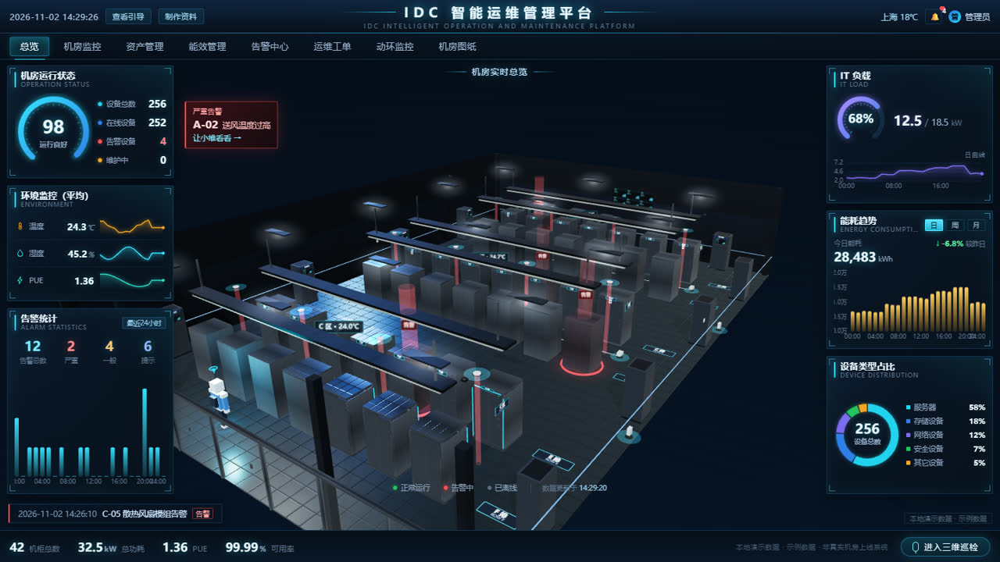 <br>**总览大屏** | 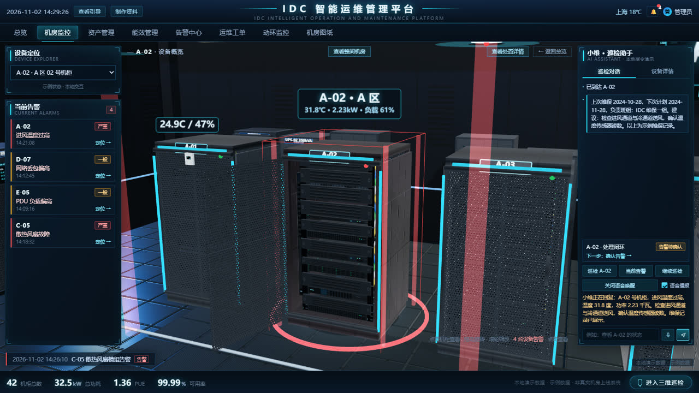 <br>**机房监控 · 处置详情** |
| 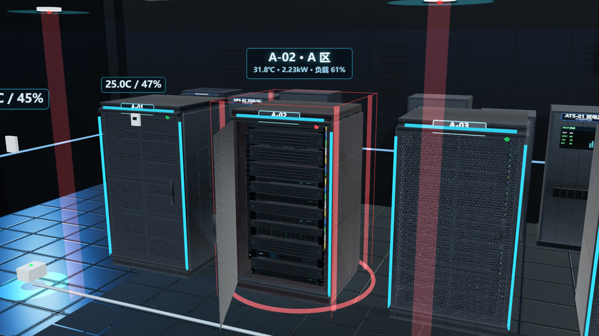 <br>**单机柜拟真特写（镂空网孔门 + 柜内 U 位设备）** |  <br>**三维机房总览（PBR + 阴影 + LOD）** |
| 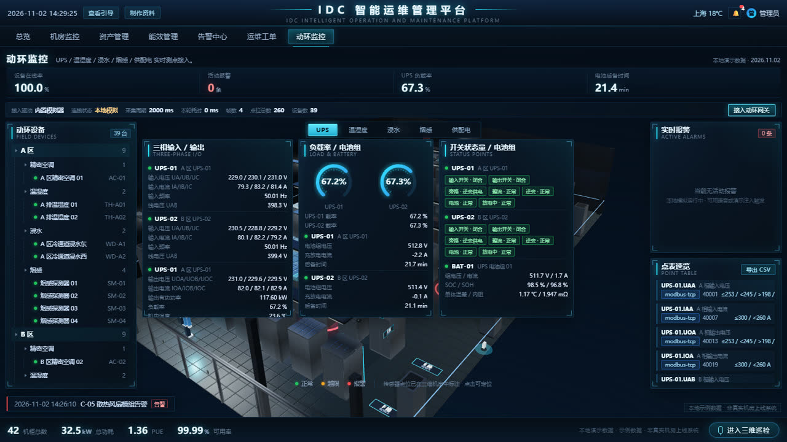 <br>**动环监控 · UPS 电源** | 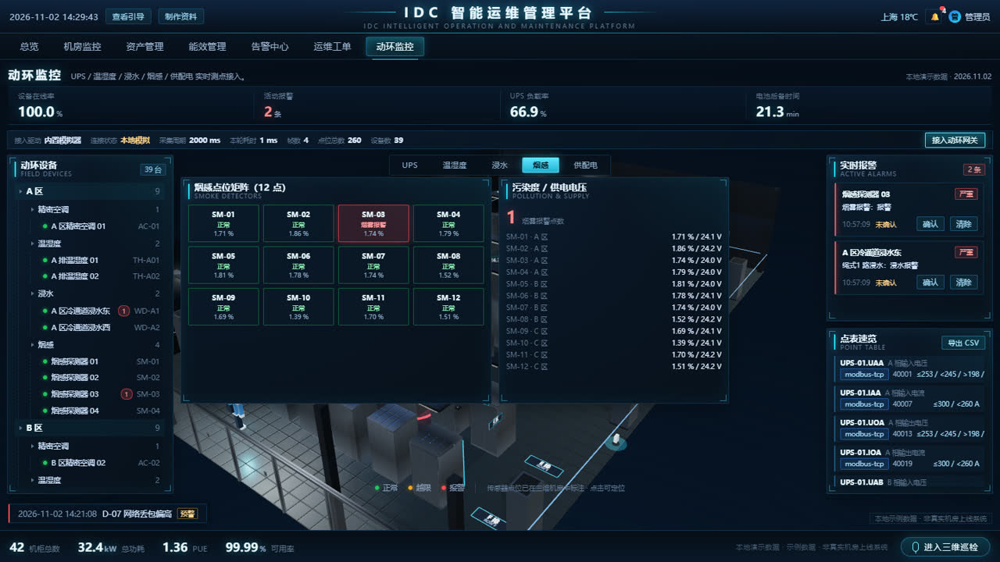 <br>**动环报警 · 烟感 / 浸水矩阵** |
| 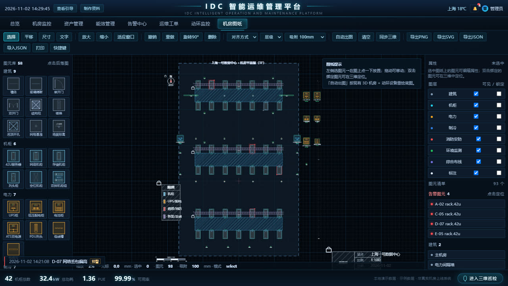 <br>**机房图纸 · 58 个图元 + 平面图** | 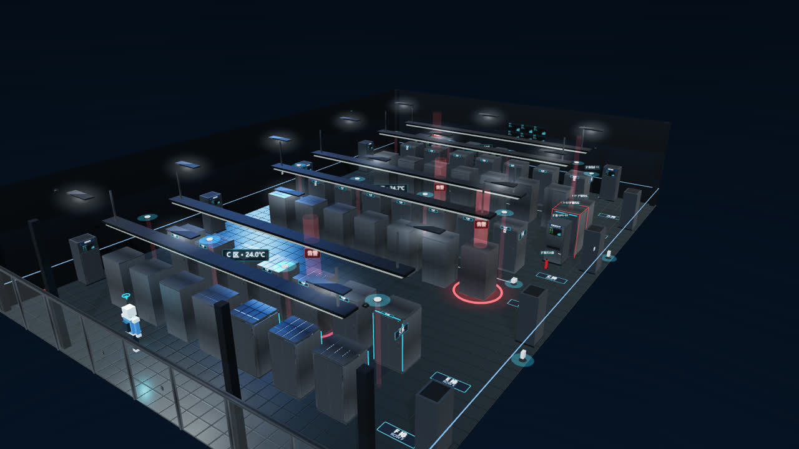 <br>**现有机房图形扩展（图纸 → 3D）** |
| 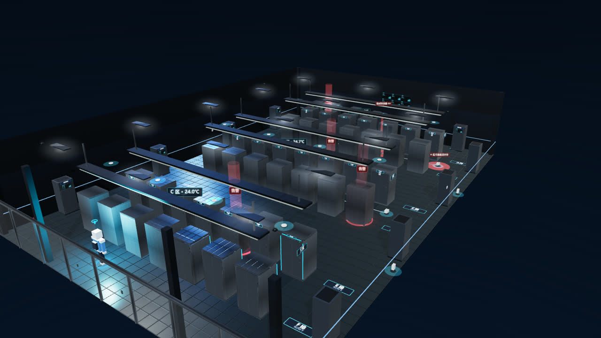 <br>**动环告警三维定位** | 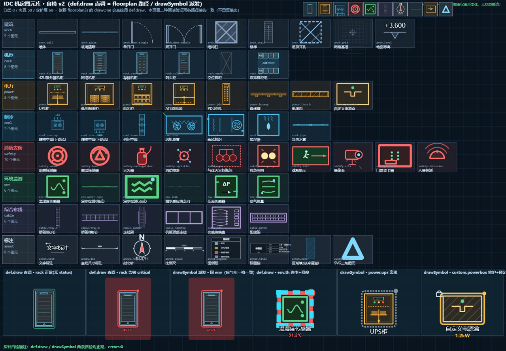 <br>**图元库 · 58 个图元 / 8 分类** |
| 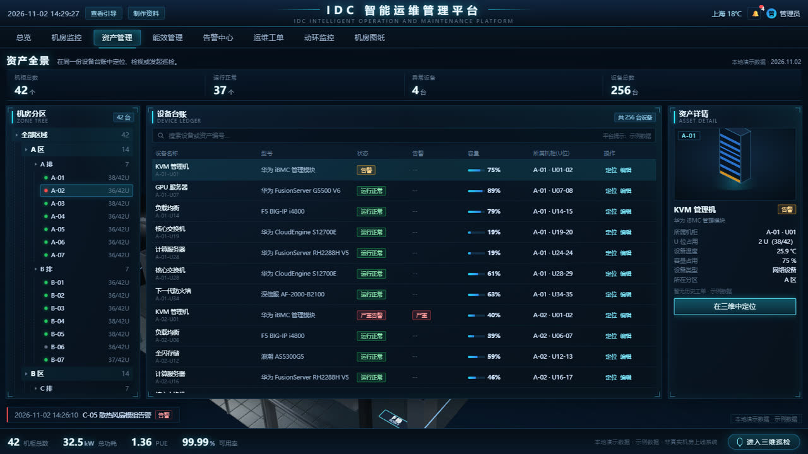 <br>**资产管理** |  <br>**能效管理** |
| 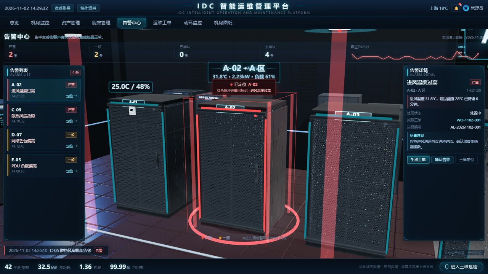 <br>**告警中心** | 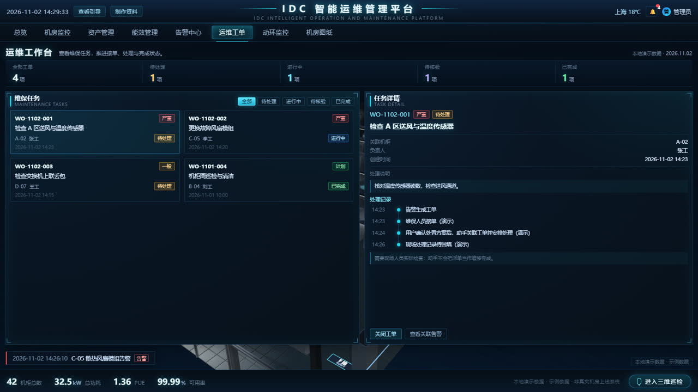 <br>**运维工单** |
| 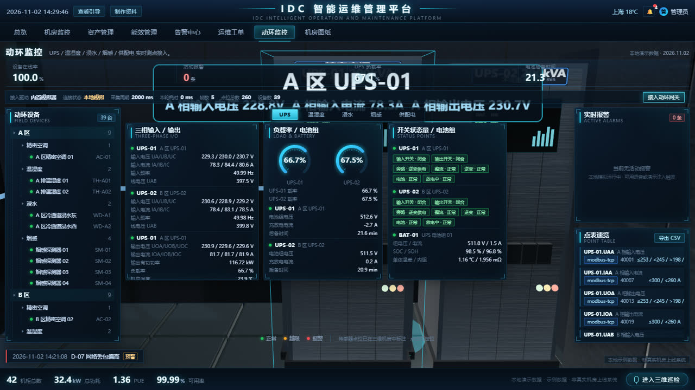 <br>**语音巡检「小维」** | 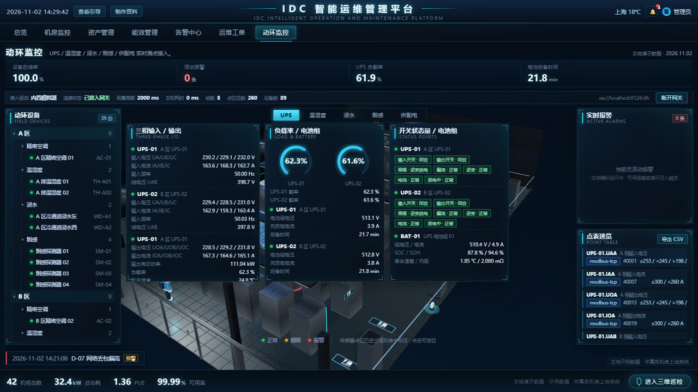 <br>**动环网关端到端联调** |
| 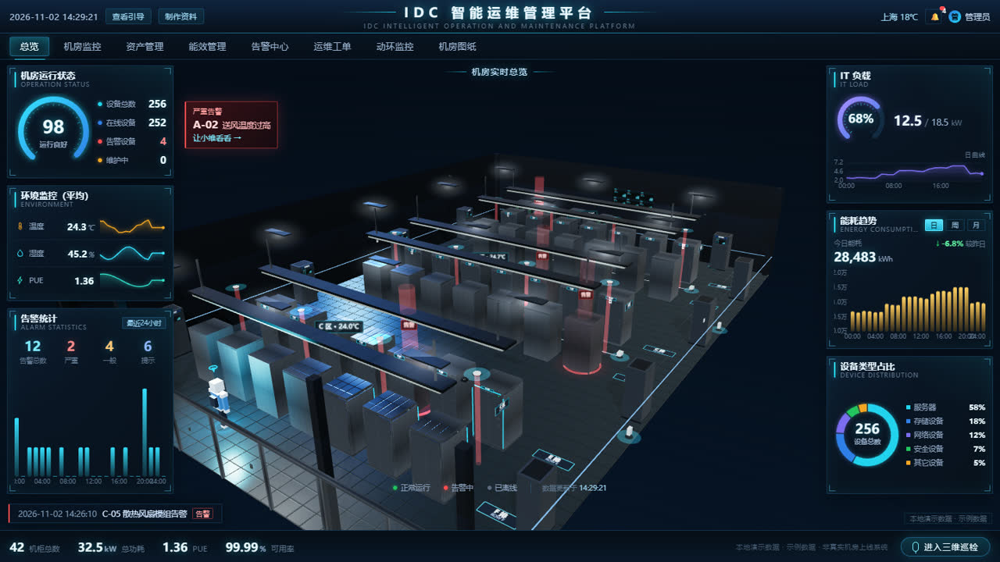 <br>**代码生成的动态片头** | 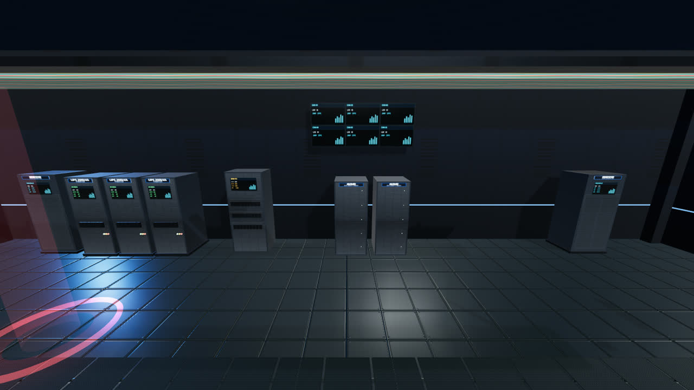 <br>**机房家具拟真特写** |

> 完整 68 张开发期截图位于本地 `shots/`（**未入库**，体积 43MB）；上表 18 张已压缩进 `docs/images/`。

## 仓库说明

| 目录 | 是否入库 | 说明 |
|---|---|---|
| `src/` `tools/` `scripts/` `vendor/` `docs/` `index.html` | ✅ | 全部源码与文档（41 个自研文件 / 约 1.7 万行；vendor 为 three.js r169 等第三方） |
| `dist/` | ❌ | esbuild 打包产物（构建生成，不入库）；源码模式用任意静态服务器即可，`| `docs/images/` | ✅ | 18 张精选界面截图（JPEG，2.2MB） |
| `docs/images/` | ✅ | 18 张精选界面截图（文档配图） |
```bash
# 克隆后 30 秒跑起来（纯源码，零依赖）
git clone <repo> && cd idc-visual-ops
python -m http.server 8123        # 任意静态服务器即可（npx serve -l 8123 / VS Code Live Server…）
# 浏览器打开 http://localhost:8123/

# 需要动环实时数据时（另开终端）
node tools/gateway/server.mjs --port 8124 --driver sim
# 浏览器打开 http://localhost:8123/?gw=1
```

---

## 一、快速开始

> **本仓库只包含源码**（构建产物 `dist/` 已按 `.gitignore` 排除），因此有三种运行方式：

### 方式 1（推荐）：用任意静态服务器跑源码（无需安装依赖、无需打包）

本仓库**只有源码**（构建产物 `dist/` 不入库）。源码以 ES 模块组织，因此需要一个 http 环境（`file://` 会被浏览器 CORS 拦截）：

```bash
# 任选一种（都在项目根目录执行）
python -m http.server 8123          # Python 3
npx --yes serve -l 8123             # Node
php -S localhost:8123               # PHP
# 或用 VS Code 的 Live Server 插件 / IDEA 内置静态服务器
```

然后浏览器打开 **http://localhost:8123/**（语音识别要求 `http://localhost` 安全上下文）。

需要动环实时数据时另开一个终端起动网关，然后以 `?gw=1` 打开：

```bash
node tools/gateway/server.mjs --port 8124 --driver sim
# 浏览器访问 http://localhost:8123/?gw=1
```

## 二、功能对照（与原视频一致）

| 模块 | 能力 |
|---|---|
| 动态片头 | 纯代码生成的镜头飞入 + 灯光逐排点亮 + 标题动画，可点击跳过 |
| 总览大屏 | 机房运行状态仪表 98、环境监控（温度/湿度/PUE）、告警统计 24h 柱图、IT 负载环图、能耗趋势、设备类型占比环图 |
| 3D 机房 | 42 台机柜（6 排 × 7 台）等轴数字孪生、架空地板/冷通道、状态灯带（正常/告警/离线）、温度热力着色、告警红色脉冲光柱、可鼠标旋转缩放 |
| **拟真化渲染** | PBR 金属材质 + 真实镂空网孔柜门（可开合看 U 位设备）+ 19" 立柱与 U 位刻度 + 四种设备面板（服务器/存储/网络/安全，带 LED 自发光）+ 盲板补满 42U + 竖装 PDU + 跳线束；600mm 架空地板方砖（倒角/螺丝/反射）、冷通道格栅、桥架与多色线缆、吊顶灯盘光晕、玻璃隔断、精密空调/UPS/配电柜/电池柜/监控大屏/门禁/摄像头等拟真组件；RoomEnvironment 环境反射 + PCFSoft 阴影 + ACES 色调映射 |
| 机房监控 | 单机柜特写、机柜门开合动画、内部 U 位设备/风扇模组、设备定位下拉、当前告警 4 条、处置详情（分析异常 / 安排处理 / 核验结果） |
| 语音巡检 | 麦克风中文识别 → 意图解析 → 小维 3D 形象走到机柜 → 开门 + 状态面板弹出 + 中文语音播报 + 结论/工单落地 |
| 资产管理 | 资产全景统计、机柜树、256 台设备台账（型号/状态/容量/所属机柜 U 位）、三维定位 |
| 能效管理 | 今日累计能耗 / PUE / 节能率 / PUE 目标、用电趋势柱图（今日·近 7 天）、PUE 变化曲线、能耗构成环图 |
| 告警中心 | 分级告警列表、3D 自动定位告警机柜、告警详情与处置建议、生成工单 |
| 运维工单 | 运维工作台统计、维保任务卡（待处理/进行中/待核验/已完成）、任务详情与处理记录时间线、关闭工单 |
| **机房图元与图纸** | **58 个机房图元**（8 分类：建筑/机柜/电力/制冷/消防安防/环境监测/综合布线/标注）、**2D 平面图自动出图 + 编辑**（拖拽/旋转/对齐/图层/撤销重做/框选/吸附/尺寸与文字标注/图例标题栏）、导出 PNG/SVG/JSON 与打印、支持 `register()`/`registerFromSvg()` **扩展自定义图元** |
| **现有机房图形扩展** | 图纸上新增的图元可一键 **同步到 3D 机房**（`scene.setExtras`）：新增机柜/UPS/配电/空调/烟感/浸水/温湿度/摄像头/灭火器/墙体/桥架等按类型生成真实三维物件，点击可在图纸与三维之间互相定位 |
| **动环监控（动力环境）** | 39 台设备 / 260 个测点：**UPS 电源**（三相输入输出电压电流、负载率、电池电压/电流/后备时间、旁路与故障状态）、精密空调、**温湿度**、**浸水**（4 绳式 + 8 点式）、**烟感**（12 点）、**低压配电/列头柜**（**电流电压**/功率/功率因数/电能）、电池组、ATS 双电源；实时报警列表 + 三级告警 + 确认/清除 + 点表导出；3D 机房内传感器实体点位与告警三维定位 |

### 语音/文字指令示例（小维）
| 说 | 小维会做 |
|---|---|
| 巡检 A-02 / 看看 A 区 2 号柜 / 查看 A-02 的状态 | 镜头飞向 A-02、小维走过去、机柜开门、高亮 31.8°C 进风温度并播报结论 |
| 当前有哪些告警 | 依次播报 4 条告警，列表与三维告警点同步高亮 |
| 检查电力数据 / 看看 PDU | 切到配电视图，播报功率 2.23 kW / 额定 3.68 kW 与负载率 |
| 整间机房 / 返回总览 | 镜头拉回总览，显示全机房温湿度 |
| 怎么会这样 / 怎么处理 | 给出排查顺序（进风通道 → 冷通道送风 → 温度传感器读数）与处置边界 |
| 生成工单 / 派人处理 | 生成 WO 工单并写入运维工单页，播报负责人 |
| 现场处理完成，复核并归档 | 温度回落正常、机柜转绿、工单推进到待核验、输出闭环小结 |
| 打开 B 排机柜 / 看看冷通道 | 通道视角切换、机柜开门 |
| UPS 状态 / UPS 怎么样 | 播报三相输入电压、负载率、电池电压、后备时间与告警 |
| 有没有浸水 / 漏水 | 播报浸水点位状态；有报警则三维定位 + 语音预警 |
| 烟感报警了吗 | 播报 12 个烟感点位状态与最高污染度 |
| 温湿度多少 | 播报平均温湿度 + 最高温区域 |
| 电流电压多少 / 供电情况 | 播报配电柜三相电压电流与有功功率 |
| 动环报警 / 哪些环境报警 | 按级别播报活动报警并切到动环页 |
| 触发浸水报警 / 演示烟感报警 | 注入演示报警 → 3D 定位 + 语音播报（用于演示/联调） |

> 一句话演示：用静态服务器打开页面（或构建后双击 index.html）→ 点底部「进入三维巡检」→ 说「**巡检 A-02**」→ 再说「**怎么处理**」→ 再说「**生成工单**」→ 再说「**现场处理完成，复核并归档**」。

---

## 三、目录结构

```
index.html                 入口（外壳：顶栏 / 页签 / 舞台 / 底部状态栏）
src/app.js                 主程序：模块装配、页面路由、时钟心跳、片头编排
src/data.js                本地模拟数据模型（42 机柜 / 256 设备 / 告警 / 工单 / 能耗）+ 事件总线
src/scene3d.js             Three.js 三维机房（拟真建模、LOD、状态可视化、小维数字人、片头）
src/textures.js            程序化 PBR 贴图与材质库（网孔门/设备面板/地板/桥架/线缆/屏幕/铭牌，含 Sobel 法线生成）
src/props.js               拟真机房组件库（精密空调/UPS/配电柜/电池柜/门禁/摄像头/灭火器/吊顶灯盘/监控大屏/KVM/传感器/分区牌）
src/hud.js                 六大页面 HUD 与手绘图表（Canvas 2D）
src/xiaowei.js             语音识别 / 语音播报 / 意图解析 / 巡检剧本状态机（含动环指令）
src/donghuan.js            动环前端接入：网关客户端 + 本地模拟器 + 报警引擎 + 北向报文
src/pointtable.js          动环点表（39 设备 / 260 测点，网关与前端共用唯一数据源）
tools/gateway/             动环南向网关（Node，零依赖）：Modbus TCP/RTU、SNMP v2c、MQTT、HTTP-JSON、设备模拟器 + WebSocket/HTTP 服务
src/base.css               外壳样式与设计令牌
src/styles.css             HUD 面板与图表样式
vendor/three.module.js     Three.js r169（本地内置，离线可用）
vendor/OrbitControls.js    轨道相机控制（已改为相对路径引用）
vendor/RoomEnvironment.js  PBR 环境反射用的程序化环境（PMREM）
scripts/serve.mjs          零依赖本地静态服务器
scripts/shot.mjs           Headless Chrome 截图 + 控制台错误检查（QA 自检用）
scripts/allshots.mjs       批量截取六大页面 + 语音剧情
ref/                       参考视频（douyin_original.mp4）+ 40 张关键帧 keyframes/ + 局部放大 crops/（还原依据，非软件依赖）
docs/REQUIREMENTS.md       需求与接口契约（还原自参考视频的逐页规格）
docs/动环接口规范.md        动环对接规范：设备/测点模型、报警规则、WS/HTTP 接口、北向上报、驱动说明
docs/提示词与制作方法.md     三段提示词 / 参考说明 / 制作流程（可选阅读）
```

## 三点五、画质与性能

| 场景 | 用法 | 说明 |
|---|---|---|
| 默认（high） | 直接打开 | 全细节机柜 + 阴影 + 环境反射；≈6.2 万三角面 / ≈508 draw call（真实 GPU 无压力） |
| 低配 / 老显卡 | 地址后加 `?quality=low` | 关阴影与环境贴图、收紧 LOD 距离、减配小道具；软件渲染下也能跑 |
| 演示/录屏 | 顶栏「查看引导」 | 自动播放 33 秒完整语音巡检剧情 |

- **LOD**：距相机 >21m（low 档 16m）的机柜自动降级为"整体柜体 + 门贴图"，聚焦机柜始终全细节；立柱/设备/盲板/地板砖/桥架等全部 InstancedMesh 实例化。
- 首次进入约 1.6~2.0s 生成 200+ 张程序化贴图与 PMREM 环境贴图（**全部本地生成，零外部图片资源**）。

## 三点七、机房图元库与二维图纸（图元元素 / 图形绘制 / 图形扩展）

> 用户需求原话："以及机房图元元素，机房图形绘制，现有机房图形扩展等！"
> 完整契约见 **`docs/机房图纸与图元规范.md`**。

### 三个视图，一份数据
- **图元库** `src/symbols.js`：**58 个专业矢量图元 / 8 分类**，单位 mm、俯视图；每个图元带默认尺寸、绑定类型、可调参数（开门方向/送风方式/桥架宽度…）、状态着色（正常绿·告警红·离线灰·维护黄 + critical 红晕脉动）与实时值文本。
- **二维图纸** `src/floorplan.js`（`IDC.plan`）：**自动出图**（按 3D 机房 42 台机柜的真实坐标 + 动环 39 台设备的 `place` 落位，含冷通道填充、桥架、电力间、图例/标题栏/指北针/比例尺）；**编辑**：网格吸附、平移缩放、单选/框选/多选、拖动、方向键微移、旋转 90°、复制粘贴、删除、六向对齐、层级、图层可见/锁定、属性面板（坐标/尺寸/旋转/图层/颜色/绑定对象/图元参数）、撤销重做（60 步）、尺寸标注、文字标注、快捷键帮助；**导出** PNG / SVG / JSON、导入 JSON、打印。
- **图形扩展**：图纸上新增的图元 → 工具栏「同步三维」/ 语音「把图纸同步到三维」→ `IDC.scene.setExtras(list)` 在 3D 机房生成真实物件（机柜/UPS/配电柜/电池柜/空调/烟感/浸水/温湿度/摄像头/灭火器/墙体/柱/桥架/标牌，未知类型用灰盒+铭牌），点击扩展物件可回到图纸定位。

### 用法
```js
// 图纸
IDC.app.goto('plan')                       // 进入机房图纸页
IDC.plan.buildFromScene()                   // 按 3D 机房 + 动环设备重新出图（保留手动新增）
IDC.plan.addSymbol('rack.42u')              // 放置图元（不传坐标自动找空位）
IDC.plan.zoomToRef('rack','A-02')           // 图纸定位（机柜/动环设备都行）
IDC.plan.applyExtras()                      // 把新增图元扩展到 3D 机房
IDC.plan.exportPNG() / exportSVG() / exportJSON()
// 图元扩展
IDC.symbols.register({ id:'custom.cabinet', name:'自定义柜', cat:'power', w:800, h:600,
  draw(ctx, it, env){ ctx.fillStyle='#2b3138'; ctx.fillRect(-it.w/2,-it.h/2,it.w,it.h); ctx.strokeRect(-it.w/2,-it.h/2,it.w,it.h); } });
IDC.symbols.registerFromSvg('custom.pump', { name:'水泵', cat:'cool', w:900, h:900 }, 'M0,-45 L45,45 L-45,45 Z');
```

### 语音
| 说 | 动作 |
|---|---|
| 打开机房图纸 / 看平面图 | 切到图纸页并播报图元总数/绑定设备数 |
| 在图纸上定位 A-02 / 图纸上找 UPS-01 | 图纸放大高亮该图元 |
| 图纸上加一台机柜 / 新增一个烟感 | 放置图元并播报落位坐标 |
| 把图纸同步到三维 / 扩展机房图形 | 新增图元同步进 3D 机房 |
| 图纸上有哪些告警 | 图纸上高亮告警图元并播报 |

## 三点六、动环（动力环境）系统对接

> 用户需求："同步开发东环系统接口，UPS电源，湿度温度，浸水，烟感，报警，供电电流电压等系统"
> 完整规范见 **`docs/动环接口规范.md`**（可直接交给集成商/厂家对点）。

### 数据链路
```
UPS/空调/温湿度/浸水/烟感/配电柜 ⟷ 动环网关(Node) ──WebSocket/HTTP──▶ 前端 IDC.dh ──▶ HUD 动环页 / 3D 点位 / 语音助手
```
- **南向驱动**：`modbus-tcp`（功能码 03/04，按 addr+dtype+scale 解码）、`modbus-rtu`、`snmp`（v2c 按 OID 取值）、`mqtt`（按 topic 映射）、`http-json`（厂家 REST）、`sim`（内置模拟器，默认）。
- **浏览器不能直接开 TCP/SNMP**，所以必须走网关；网关不在时前端自动降级为**本地模拟器**，功能演示不受影响。
- **点表唯一数据源**：`src/pointtable.js`（39 设备 / 260 测点：132 模拟量 + 128 状态量，含寄存器地址/SNMP OID/MQTT topic/阈值/位定义）。换厂家只改点表，不动代码。

### 启动
1. 先起网关：`node tools/gateway/server.mjs --port 8124 --driver sim`（网关为 Node 源码，零 npm 依赖），再用 `?gw=1` 打开前端 → 动环页显示"已接入网关"。
2. 单独启动网关：`node tools/gateway/server.mjs --port 8124 --driver sim`（`--driver` 可换 `modbus-tcp|snmp|mqtt|http-json`）。
3. 直接用 `index.html`（无网关）：前端用**本地模拟器**跑同一套点表，功能完整。
4. 前端强制/关闭网关：`?gw=1`（默认 8124）、`?gw=ws://10.0.0.5:8124/dh`（指定地址）、`?gw=off`。

### 网关接口
| 接口 | 说明 |
|---|---|
| `ws://localhost:8124/dh` | 实时推送：`hello`（点表+设备）/ `data`（变化点，每 10 轮全量）/ `status` / `alarm` / `event` |
| `GET /dh/health` | 网关状态、驱动、采集周期、点位/设备数、错误数 |
| `GET /dh/points` · `/dh/points.csv` | 点表导出（CSV 可直接交厂家对点） |
| `GET /dh/snapshot` · `/dh/alarms` | 全量实时值 / 活动报警 |
| `POST /dh/inject` | 演示注入：`{"pointId":"WD-A1.ch1","value":1}` 或 `{"deviceId":"SM-03","action":"smoke"}` |
| `POST /dh/driver` | 切换驱动：`{"driver":"modbus-tcp"}` |

### 报警规则（网关与前端同规则）
AI 越限 `hi/hiHi/lo/loLo` + **回差 deadband** + **持续延时确认**；DI 变位（烟感/浸水 = 严重，旁路/ATS = 一般）；设备 30s 无响应 = 通信中断（提示）。报警状态：活动 → 已确认 → 已恢复。

### 北向接口（向上级平台上报）
`IDC.dh.northbound()` 产出标准报文（站点 / 设备在线 / 活动报警 / 指标：在线率、UPS 负载、电池后备、平均温度），对应 `/north/metrics|alarms|points|history` 约定，可经 WS 推送 / HTTP POST 周期上报 / MQTT 发布（见规范 §4）。

## 四、开发说明

本仓库**只包含项目源码**：构建产物（`dist/`）、启动/部署脚本、打包与自动化 QA 工具均不在仓库内。
源码以 ES 模块组织，用任意静态服务器以 `http://localhost` 方式打开即可运行；
动环网关（`tools/gateway/`）是 Node 源码，可直接 `node tools/gateway/server.mjs --port 8124 --driver sim` 运行（零 npm 依赖）。


## 五、说明
- 界面所有数据均为示例数据，页面已标注「本地演示数据 · 示例数据」。
- 项目仅为技术演示，未接入真实动环/监控系统；接入时替换 `src/data.js` 的取数层与 `IDC.data.tick()` 即可。
---

## 六、界面上的两个彩蛋按钮

- 顶栏 **「查看引导」**：一键播放完整语音巡检剧情（`IDC.xiaowei.demo()`：巡检 A-02 → 当前告警 → 电力数据 → 怎么处理 → 生成工单 → 现场处理完成闭环），约 33 秒。
- 顶栏 **「制作资料」**：弹出本项目用到的**三段提示词 / Skill 来源 / 语音指令示例**（对应参考视频结尾"提示词和制作资料，整理好了"），完整版见 `docs/提示词与制作方法.md`。

## 七、验收证据（shots/）

| 截图 | 内容 |
|---|---|
| `hud_overview.png` | 总览大屏：运行良好 98、环境监控 24.3℃/45.2%/1.36、告警统计 12/2/4/6、IT 负载 68%、能耗趋势 28,430 kWh、设备类型占比 256 |
| `hud_monitor_3d.png` / `scene_monitor.png` | 机房监控 · 三维态：单机柜 A-02 居中特写、柜门打开、U 位设备与挡板可见、邻柜保留 |
| `hud_monitor.png` | 机房监控 · 处置态：A-02 处置详情（分析异常/安排处理/核验结果）、告警依据、关联工单 WO-1102-001 |
| `hud_assets.png` | 资产全景 42/37/4/256 + 机柜树 + 256 台设备台账 + 资产详情 |
| `hud_energy.png` | 能效分析：210,785 kWh / PUE 1.36 / 节能率 -6.8% / PUE 目标 1.40 + 用电趋势 + PUE 曲线 + 用能构成 |
| `hud_alarms.png` | 告警中心：分级列表 + 三维定位 A-02（红色光柱/光圈）+ 告警详情与处置建议 |
| `hud_workorder.png` | 运维工作台：工单卡 WO-1102-001~004 + 任务详情时间线 |
| `scene_overview.png` | 三维机房总览：6 排机柜 + 冷通道 + 桥架 + 吊顶灯盘 + 告警光柱 + 小维 |
| `scene_rack.png` / `scene_props.png` | 拟真细节：单柜特写（镂空网孔门/柜内 1U 设备/立柱刻度/PDU）、机房家具特写（精密空调/UPS/配电柜/电池柜/大屏） |
| `ref_realistic_look.png` / `ref_props_look.png` | 拟真化改造时用的材质与光影基准图 |
| `hud_donghuan.png` / `hud_donghuan_alarm.png` / `hud_donghuan_alarm_water.png` | 动环监控页：接口状态条 + 4 KPI + 设备树 + UPS/温湿度/浸水/烟感/供配电五分区 + 实时报警列表（含确认·清除）+ 点表速览/CSV 导出；注入烟感+浸水后矩阵与列表同步标红 |
| `scene_sensors.png` / `scene_sensor_alarm.png` / `scene_sensor_focus.png` | 3D 传感器点位：吊顶烟感、冷通道浸水绳/点式、机柜温湿度、电力柜；报警红脉冲光圈+光束+浮空标签；单点聚焦特写 |
| `voice_ups.png` / `voice_water.png` / `voice_trigger.png` | 语音动环指令：「UPS 状态」「有没有浸水」「触发浸水报警」→ 分区切换 + 3D 定位 + 播报 |
| `plan_overview.png` / `page_plan.png` | 机房二维图纸：图元库（58 个/8 分类）+ 42 台机柜平面图 + 冷通道/桥架/电力间 + 图例·标题栏·指北针 + 右侧图层与图元清单（含告警图元） |
| `ref_symbols.png` | 图元库全量图元总览（8 分类网格） |
| `scene_extras.png` / `scene_extra_focus.png` | **图形扩展**：图纸新增的机柜/UPS/灭火器已在 3D 机房出现（带「扩展」铭牌） |
| `voice_plan_open.png` / `voice_plan_locate.png` / `voice_plan_add.png` | 图纸语音：打开图纸 / 定位 A-02 / 新增机柜 |
| `e2e_gateway.png` | **端到端联调**：动环网关（8124）起动后，前端以 `ws://localhost:8124/dh` 接入（页面显示"已接入网关"、1000ms 周期、260 测点、UPS 三相/电池实时值、网关侧注入的两条 critical 报警） |
| `voice_inspect.png` / `voice_inspect_3d.png` | 语音巡检 A-02：小维回复 + 镜头对准机柜 + 下一步建议 |
| `voice_alarm.png` | 多轮对话：当前告警 → 电力数据 → 排查顺序 |
| `voice_close.png` | 闭环：温度回落 24.2℃、工单推进「待核验」、处理记录落地 |

复现方式：`---

## 八、许可证与合规

| 文档 | 内容 |
|---|---|
| [LICENSE](LICENSE) | 本项目采用 **AGPL-3.0-or-later**（GNU Affero 通用公共许可证 v3 或更新版本） |
| [COMMERCIAL-LICENSE.md](COMMERCIAL-LICENSE.md) | **商业双授权说明**：什么情况必须购买商业授权、授权范围、联系方式、贡献者 CLA、商标声明 |
| [THIRD-PARTY-NOTICES.md](THIRD-PARTY-NOTICES.md) | 第三方组件清单：three.js r169（MIT，vendor/）、esbuild（MIT，开发期）、puppeteer-core（Apache-2.0，开发期） |
| [vendor/LICENSE-three.txt](vendor/LICENSE-three.txt) | three.js 的 MIT 许可全文（覆盖未自带声明的 OrbitControls / RoomEnvironment） |
| [docs/合规与许可说明.md](docs/合规与许可说明.md) | **合规体检报告**：协议授权状态、商标与素材、点表保密、语音识别数据出境、公开前自查清单 |

**要点（详见合规文档）**

- 🔑 **双授权模式**：开源用 AGPL-3.0-or-later（强 copyleft，网络服务也必须开源），商业闭源集成/SaaS 托管走商业授权 —— 这是 MySQL / Grafana / Nextcloud 一类项目的通行做法。
- 🟢 **协议零风险**：Modbus TCP/RTU、SNMP v2c、MQTT 3.1.1、HTTP/WebSocket 均为公开标准，本项目**按规范自行实现客户端**，未使用任何厂家 SDK，无授权费、无 copyleft。
- 🟡 **需保留署名**：three.js 系 MIT，已保留文件头许可并补充 `vendor/LICENSE-three.txt`（合规动作已完成）。
- 🟡 **素材不入库**：参考视频与抽帧图（`ref/`）已被 `.gitignore` 排除，避免重新分发第三方视频。
- 🟡 **品牌型号仅示例**：界面中的华为/维谛/施耐德等仅为演示型号引用，与厂商无关联（已在第三方声明中明示）；正式项目建议替换为中性名称。
- 🔴 **语音识别需你决策**：Chrome/Edge 的 `webkitSpeechRecognition` 会把音频上传到**浏览器厂商云端**；涉密/合规机房建议改用**文字输入**（已完整支持）或接入**本地 ASR**（`IDC.xiaowei` 的语音接口已隔离，替换成本低）。
- ⚠️ **接真实设备时**：厂家《通信协议手册/点表》通常含 NDA，请勿把真实点表、IP、账号、拓扑提交到公开仓库（仓库内点表为**示例数据**）。真正的机房数据请放私有仓库或 `*.local`。

> 本项目为**技术演示**（示例数据、非真实机房上线系统）。合规文档为工程视角体检，不构成法律意见；商业化或进入金融/政务/涉密场景前请法务复核。