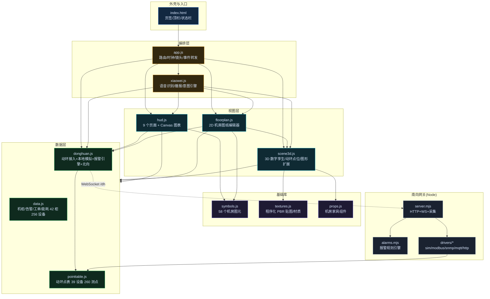
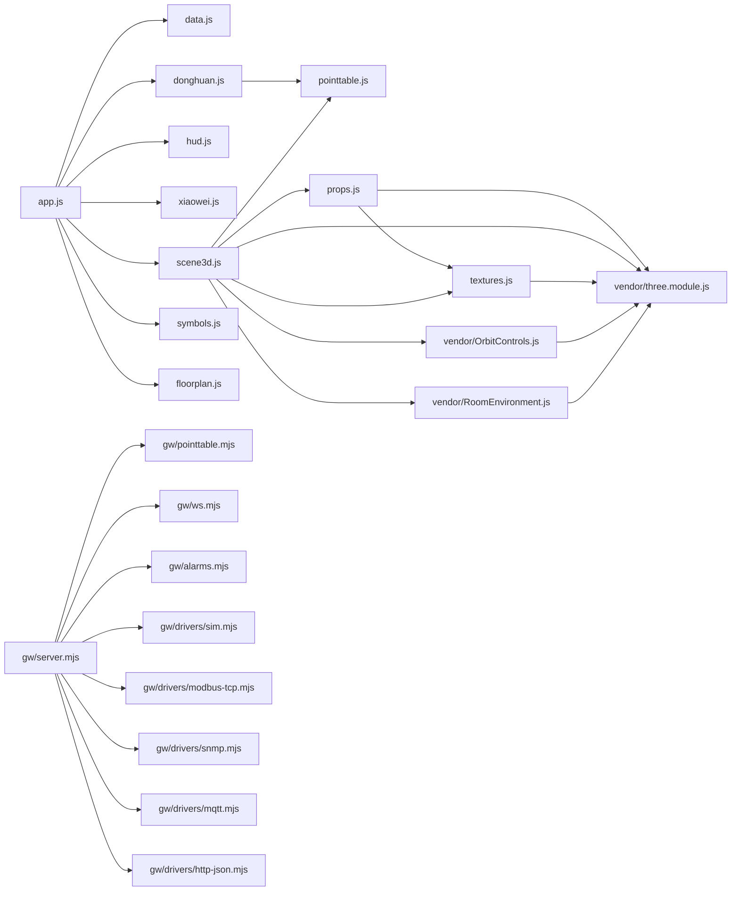
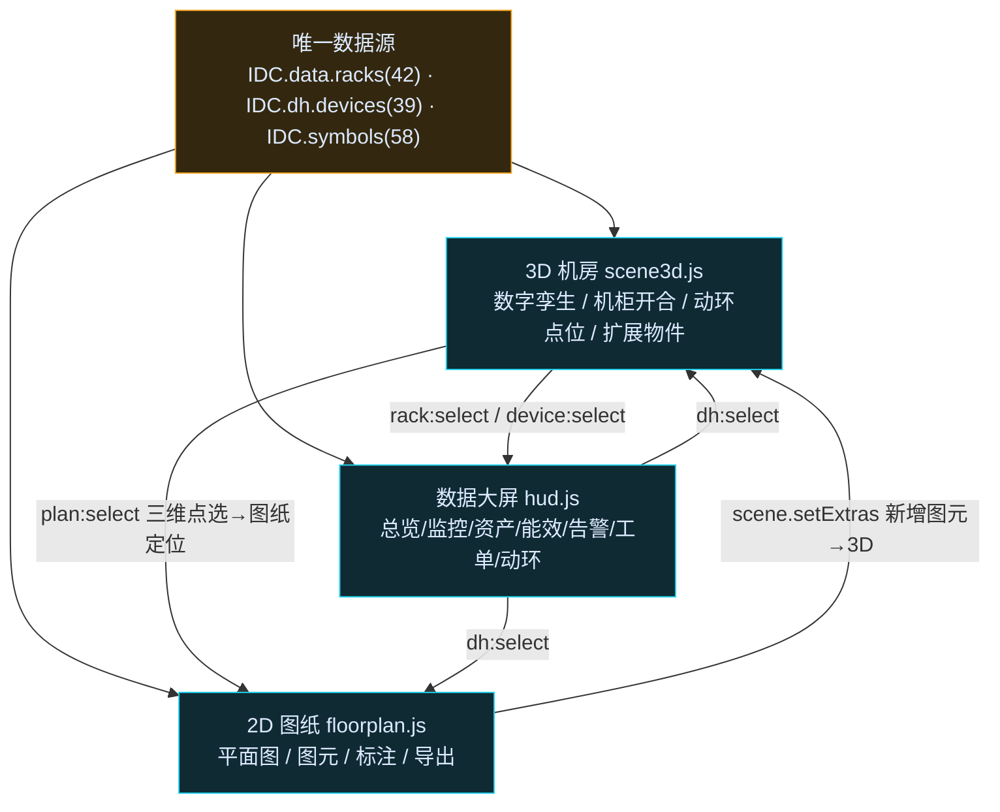
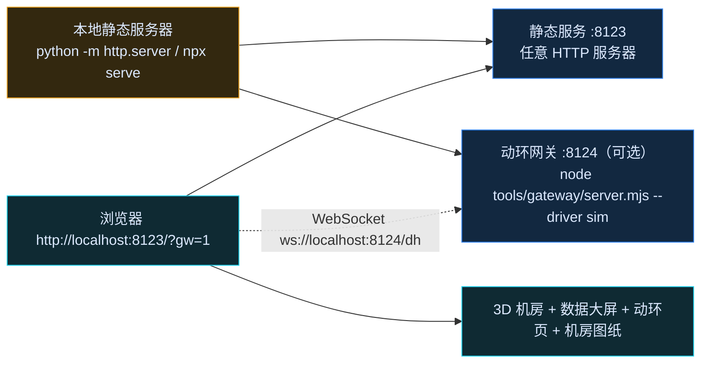

# 项目结构图谱（自动生成）

> 由 `tools/arch/graph.mjs` 从源码静态分析生成，**请勿手工编辑**；改动代码后重新执行 `node tools/arch/graph.mjs` 即可刷新。
> 生成时间：2026/10/9 13:52:18 · 统计：**34 个自研文件 / 16384 行** + 第三方 55825 行（不含 node_modules、ref、shots、dist）

## 1. 分层架构总览



## 2. 模块依赖图（源码 import 关系）



## 3. 事件总线图谱（`IDC.bus`：`emit → on`，模块解耦的唯一通道）

```mermaid
flowchart LR
  "gw/drivers/mqtt.mjs" & "gw/ws.mjs" -->|error| "gw/drivers/http-json.mjs" & "gw/drivers/modbus-tcp.mjs" & "gw/drivers/mqtt.mjs" & "gw/drivers/snmp.mjs" & "gw/server.mjs" & "gw/test.mjs" & "gw/ws.mjs"
  "docs/REQUIREMENTS.md" & "hud.js" & "scene3d.js" -->|rack:select| "app.js" & "hud.js" & "xiaowei.js"
  "docs/动环接口规范.md" & "hud.js" & "scene3d.js" & "xiaowei.js" -->|dh:select| "app.js" & "hud.js"
  "-" -->|data| "gw/drivers/http-json.mjs" & "gw/drivers/modbus-tcp.mjs" & "gw/drivers/mqtt.mjs" & "gw/server.mjs" & "gw/test.mjs" & "gw/ws.mjs"
  "docs/REQUIREMENTS.md" & "data.js" -->|data:tick| "floorplan.js" & "hud.js" & "scene3d.js"
  "docs/机房图纸与图元规范.md" & "floorplan.js" & "scene3d.js" & "xiaowei.js" -->|plan:select| "floorplan.js"
  "donghuan.js" -->|dh:alarm| "app.js" & "floorplan.js" & "hud.js" & "scene3d.js"
  "donghuan.js" -->|dh:alarm:clear| "app.js" & "floorplan.js" & "hud.js" & "scene3d.js"
  "gw/drivers/mqtt.mjs" & "gw/ws.mjs" -->|close| "gw/drivers/modbus-tcp.mjs" & "gw/drivers/mqtt.mjs" & "gw/ws.mjs"
  "gw/drivers/mqtt.mjs" & "gw/ws.mjs" -->|message| "gw/drivers/mqtt.mjs" & "gw/drivers/snmp.mjs" & "gw/server.mjs"
  "data.js" -->|alarm:add| "app.js" & "hud.js" & "scene3d.js"
  "donghuan.js" -->|dh:data| "floorplan.js" & "hud.js" & "scene3d.js"
  "app.js" -->|page| "hud.js" & "scene3d.js"
  "hud.js" -->|monitor:view| "app.js" & "hud.js"
  "donghuan.js" -->|dh:ready| "app.js" & "hud.js"
  "-" -->|end| "gw/drivers/http-json.mjs" & "gw/server.mjs" & "gw/ws.mjs"
  "gw/drivers/mqtt.mjs" & "gw/ws.mjs" -->|pong| "gw/ws.mjs"
  "data.js" -->|event:add| "app.js"
  "scene3d.js" -->|device:select| "app.js"
  "data.js" -->|alarm:ack| "hud.js"
  "data.js" -->|wo:update| "hud.js"
  "donghuan.js" -->|dh:device| "hud.js"
  "donghuan.js" -->|dh:alarm:ack| "hud.js"
  "xiaowei.js" -->|assistant:listen| "hud.js"
  "gw/ws.mjs" -->|connection| "gw/server.mjs"
  "-" -->|toast| "app.js"
```

## 4. 数据流与接口链路

```mermaid
flowchart LR
  DEV["动环设备<br/>UPS/空调/温湿度/浸水/烟感/配电"]:::hw -->|Modbus TCP·RTU / SNMP / MQTT / HTTP-JSON| GW["动环网关 tools/gateway<br/>采集·归一化·报警引擎"]:::gw
  GW -->|WebSocket /dh + HTTP /dh/*| DHM["src/donghuan.js<br/>点表·值·质量码·报警·北向报文"]:::sw
  SIM["sim 驱动（内置模拟器）"]:::gw --> GW
  DHM -->|bus: dh:data / dh:alarm| HUD2["动环监控页"]:::ui
  DHM --> SC3["3D 传感器点位/告警定位"]:::ui
  DHM --> XW2["语音播报"]:::ui
  DHM --> PLN["图纸图元状态/告警标红"]:::ui
  DHM -->|northbound()| UP["上级平台 /north/metrics|alarms|points|history"]:::hw
  classDef hw fill:#1a2230,stroke:#8aa0bd,color:#dce9ff
  classDef gw fill:#0f2a1e,stroke:#22c55e,color:#dce9ff
  classDef sw fill:#122840,stroke:#2f7fe8,color:#dce9ff
  classDef ui fill:#0f2a33,stroke:#22d3ee,color:#dce9ff
```

## 5. 三个视图共用一份数据



## 6. 页面 × 模块矩阵

| 页面 | key | 主要数据源 | 主要 3D 交互 |
|---|---|---|---|
| 总览 | overview | `IDC.data.kpi/racks/alarms/energy` | 机房等轴总览 + 告警光柱 |
| 机房监控 | monitor | `IDC.data.racks` + `IDC.dh` | 单柜特写 / 开门 / 处置态切换 |
| 资产管理 | assets | `IDC.data.allDevices()` | 三维定位机柜 |
| 能效管理 | energy | `IDC.data.energy` | — |
| 告警中心 | alarms | `IDC.data.alarms` | 告警机柜定位 + 光柱 |
| 运维工单 | workorder | `IDC.data.workOrders` | — |
| **动环监控** | donghuan | `IDC.dh`（260 测点） | 传感器点位 / 报警光圈光束 |
| **机房图纸** | plan | `IDC.symbols` + `IDC.plan.model` | 图纸图元 ↔ 3D 扩展/定位 |

## 7. 目录结构

```
idc-visual-ops/
├── docs/
│   ├── images/
│   │   ├── 01_overview.jpg  (136 KB)
│   │   ├── 02_monitor.jpg  (167 KB)
│   │   ├── 03_rack_closeup.jpg  (136 KB)
│   │   ├── 04_room_overview.jpg  (77 KB)
│   │   ├── 05_donghuan_ups.jpg  (142 KB)
│   │   ├── 06_donghuan_alarm.jpg  (137 KB)
│   │   ├── 07_floorplan.jpg  (145 KB)
│   │   ├── 08_plan_extras_3d.jpg  (78 KB)
│   │   ├── 09_sensor_alarm_3d.jpg  (81 KB)
│   │   ├── 10_assets.jpg  (127 KB)
│   │   ├── 11_energy.jpg  (90 KB)
│   │   ├── 12_alarms.jpg  (156 KB)
│   │   ├── 13_workorder.jpg  (93 KB)
│   │   ├── 14_voice_ups.jpg  (155 KB)
│   │   ├── 15_symbols.jpg  (201 KB)
│   │   ├── 16_gateway_e2e.jpg  (141 KB)
│   │   ├── 17_intro.jpg  (137 KB)
│   │   ├── 18_props_closeup.jpg  (78 KB)
│   │   ├── header.png  (268 KB)
│   │   └── header.svg  (9 KB)
│   ├── 动环接口规范.md  (14 KB)
│   ├── 合规与许可说明.md  (9 KB)
│   ├── 机房图纸与图元规范.md  (9 KB)
│   ├── 提示词与制作方法.md  (7 KB)
│   ├── 项目图谱.html  (32 KB)
│   ├── 项目图谱.md  (13 KB)
│   ├── 项目图谱.svg  (28 KB)
│   └── REQUIREMENTS.md  (17 KB)
├── src/
│   ├── app.js  (11 KB)
│   ├── base.css  (14 KB)
│   ├── data.js  (18 KB)
│   ├── donghuan.js  (27 KB)
│   ├── floorplan.js  (69 KB)
│   ├── hud.js  (116 KB)
│   ├── pointtable.js  (18 KB)
│   ├── props.js  (10 KB)
│   ├── scene3d.js  (96 KB)
│   ├── styles.css  (43 KB)
│   ├── symbols.js  (92 KB)
│   ├── textures.js  (34 KB)
│   └── xiaowei.js  (59 KB)
├── tools/
│   └── gateway/
│       ├── drivers/
│       │   ├── http-json.mjs  (8 KB)
│       │   ├── modbus-tcp.mjs  (11 KB)
│       │   ├── mqtt.mjs  (12 KB)
│       │   ├── sim.mjs  (13 KB)
│       │   └── snmp.mjs  (10 KB)
│       ├── alarms.mjs  (9 KB)
│       ├── pointtable.mjs  (1 KB)
│       ├── server.mjs  (22 KB)
│       ├── test.mjs  (19 KB)
│       └── ws.mjs  (10 KB)
├── vendor/
│   ├── LICENSE-three.txt  (2 KB)
│   ├── OrbitControls.js  (31 KB)
│   ├── RoomEnvironment.js  (4 KB)
│   └── three.module.js  (1274 KB)
├── .gitignore  (1 KB)
├── COMMERCIAL-LICENSE.md  (3 KB)
├── index.html  (5 KB)
├── LICENSE  (34 KB)
├── README.md  (30 KB)
└── THIRD-PARTY-NOTICES.md  (3 KB)
```

## 8. 源码体量

| 文件 | 行数 | 说明 |
|---|---|---|
| `src/hud.js` | 2225 | 定义 IDC.data, hud |
| `src/symbols.js` | 2204 | 定义 IDC.symbols |
| `src/scene3d.js` | 2083 | 定义 IDC.scene |
| `src/xiaowei.js` | 1218 | 定义 IDC.xiaowei |
| `src/floorplan.js` | 1010 | 定义 IDC.plan |
| `src/textures.js` | 693 | src · 1 个相对依赖 |
| `src/styles.css` | 609 | src |
| `src/donghuan.js` | 540 | 定义 IDC.dh |
| `tools/gateway/server.mjs` | 494 | tools · 8 个相对依赖 |
| `src/data.js` | 369 | 定义 IDC.bus, data |
| `README.md` | 347 | README.md |
| `tools/gateway/test.mjs` | 328 | tools · 0 个相对依赖 |
| `tools/gateway/drivers/sim.mjs` | 308 | tools |
| `tools/gateway/ws.mjs` | 289 | tools · 0 个相对依赖 |
| `tools/gateway/drivers/mqtt.mjs` | 281 | tools · 0 个相对依赖 |
| `docs/项目图谱.md` | 271 | docs |
| `tools/gateway/drivers/modbus-tcp.mjs` | 270 | tools · 0 个相对依赖 |
| `src/pointtable.js` | 266 | src |
| `tools/gateway/drivers/snmp.mjs` | 262 | tools · 0 个相对依赖 |
| `docs/项目图谱.html` | 260 | docs |
| `src/app.js` | 249 | 定义 IDC.app |
| `src/props.js` | 228 | src · 2 个相对依赖 |
| `tools/gateway/alarms.mjs` | 222 | tools |
| `docs/REQUIREMENTS.md` | 212 | docs |
| `src/base.css` | 211 | src |
| `docs/动环接口规范.md` | 184 | docs |
| `tools/gateway/drivers/http-json.mjs` | 176 | tools · 0 个相对依赖 |
| `docs/机房图纸与图元规范.md` | 140 | docs |
| `index.html` | 104 | index.html |
| `docs/合规与许可说明.md` | 98 | docs |
| `docs/提示词与制作方法.md` | 96 | docs |
| **合计** | **16384** | 34 个自研文件 + 第三方库 55825 行（vendor/three.module.js 等） |

## 9. 运行拓扑


